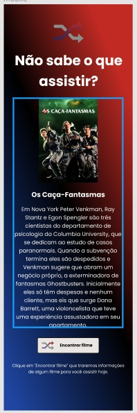
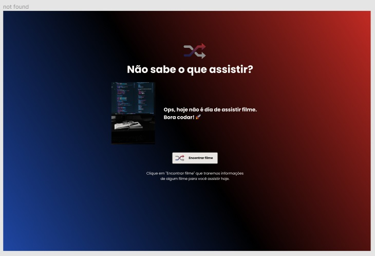
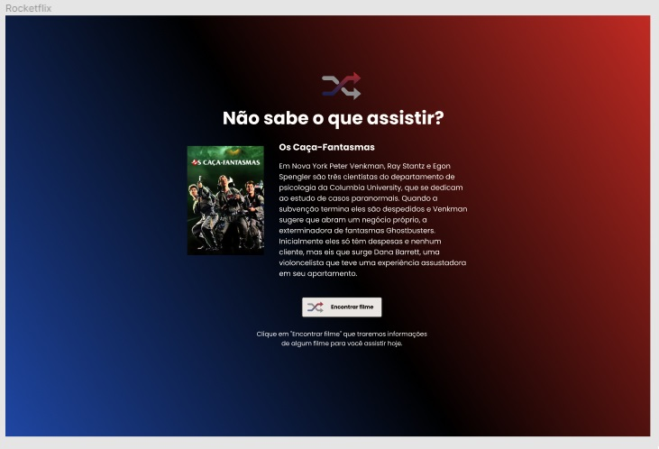

<h4 align="center"> 
	🚧 Rocketflix 🚀
</h4>

<p align="center" style="display: flex; align-items: flex-start; justify-content: center;">
  
</p>  

### 💻 Sobre o desafio

Neste desafio você deverá utilizar a API do themoviedb.org para exibir um filme aleatório sempre que clicar em Encontrar Filme.

#### 💻 Techs

- Nível de dificuldade: Avançado
- Tecnologias: HTML, CSS e Javascript.

#### 💻 Como começar?

1 - Use o link do [Figma](https://www.figma.com/file/blXvvh2RnpTsuy0jtltpiw/DD-%2F-Rocketflix-(Copy)?node-id=3%3A2) como base para o projeto. Também disponibilizamos para download todos os assets necessários (imagens e ícones), para fazer o download basta clicar no link acima.  

2 - Leia com atenção todas as instruções do desafio.

3 - Bora codar! Lembre-se que você pode usar as tecnologias que se sentir mais confortável, mas também pode se desafiar usando novas techs, fazendo modificações e/ou adicionando funcionalidades no projeto como preferir. 🚀

4 - Compartilhe seu resultado ou tire suas dúvidas na nossa [**comunidade aberta**](https://discord.gg/bacwY2gDCF)

### 💡 Conteúdos Aplicados

Para construir esse projeto, na trilha Discover há diversas referências que irão contribuir na realização dessa tarefa.

#### 💡 [Guia Estelar de HTML](https://app.rocketseat.com.br/discover/course/o-guia-estelar-de-html?&) 
O conteúdo esclarece plugin de preview HTML, tags, atributos, semântica, listas, abreviações, listas, representação de código, URLs, diretórios, tabelas, THead, TBody, colgroup, cabeçalho, meta, favicon, meta SEO e meta social. 

#### 💡 [Guia Estelar de CSS](https://app.rocketseat.com.br/discover/course/o-guia-estelar-de-css?&) 
O conteúdo aborda anatomia, seletores, box model, cascata, especificidade, shorthand, funções, devtools e vendor prefixes. 

#### 💡 [Posicionamento de Foguetes](https://app.rocketseat.com.br/discover/course/posicionando-foguetes?&) 
Você precisa saber onde os elementos da sua página deverão ser posicionados. Por isso, conhecer como o CSS trabalha com o layout, ou o posicionamento dos elementos na sua página é essencial.

#### 💡 [Guia Estelar de Javascript](https://app.rocketseat.com.br/node/o-guia-estelar-de-java-script) 
As aulas deste conjunto abordam tipos de dados, variáveis, funções, manipulação de dados, expressões e aplicabilidade dos recursos. 

#### 💡 [Pilotando com a DOM](https://app.rocketseat.com.br/discover/course/pilotando-com-a-dom?&) 
O módulo explora atributos e funcionalidades da DOM, getElementById, ByClassName e ByTagName, além de querySelector, querySelectorAll, textContent, innerText, innerHTML, Value, alteração com style, classList, parentElement e parentNode, elementos filhos e irmãos, insertBefore, métodos para adição de eventos via JS.

E também, há esses vídeos que podem ajudar

- 💡 [API ajax fetch axios](https://youtu.be/vYlz3SmNXQQ)
- 💡 [O DOM é um objeto js](https://youtu.be/UftSB4DaRU4)
- 💡 [Consumir api com axios](https://youtu.be/VM4e37DaskU)

### 🚀 [Requisitos do projeto](https://efficient-sloth-d85.notion.site/Desafio-Rocketflix-5ca1c56b5e52473eb12e8b2bc3ab1b8d#06e6ecb4212447c695dfbe7da61ec551)

#### 🚀 Requisitos para o desafio 

Neste desafio você vai construir uma página que exiba aleatóriamente um filme para o usuário. Caso você ainda não tenha feito os cursos do Discover ou queira fazer uma revisão, segue abaixo uma lista dos cursos que podem te ajudar a resolver este desafio.

##### 🚀 Requisitos Principais

- [ ] 1. Consumir a [API themoviedb.org](https://www.themoviedb.org/)
- [ ] 2. Ter um botão que traga um filme aleatório com poster e descrição do filme.
- [ ] 3. Se o filme não existir, apresente uma mensagem e imagem informando que o filme não está disponível.

##### 🚀 Requisitos Extras

- [ ] 1. Tornando o site responsivo
- [ ] 2. Exibindo mais informações sobre os filmes que vem da API (Data de lançamento, atores...)

#### 🎨 Style Guide

##### 🎨 Cores 

- [ ] Usar as variáveis

```css
:root {
  --title: #fffcf9;
  --subtitle: #b3b3b3;
  --bg-button: #e9e6e3;
  --background: linear-gradient(43deg, #102d71 0%, #000000 52%, #c12a23 100%);
}
```

##### 🎨 Fonte 

- [ ] font-family: Poppins 
- [ ] font-weight: 300, 400 e 500
- [ ] Você pode encontrar a fonte no [Google Fonts](https://fonts.google.com/) 

#### 🎨 Como deve ficar a página ao final?
 
 Neste desafio você deverá utilizar a API do themoviedb.org para exibir um filme aleatório sempre que clicar em Encontrar Filme.

<p align="center" style="display: flex; align-items: flex-start; justify-content: center;"> 
  
</p> 

🚀 Bora codar! Lembre-se que você pode usar as tecnologias que se sentir mais confortável, mas também pode se desafiar usando novas techs, fazendo modificações e/ou adicionando funcionalidades no projeto como preferir. 🚀

### 📅 Entrega

Após concluí-los, adicionar esses códigos ao seu Github é uma boa forma de demonstrar seus conhecimentos para oportunidades futuras.

#### 📅 Tarefas

- [x] Criar uma conta no [https://www.themoviedb.org/signup](https://www.themoviedb.org/signup)
- [x] Após verificar o e-mail, faça o login e [acesse este link](https://www.themoviedb.org/settings/api/request)
- [x] Clicar em Criar e escolha a opção Developer

- [x] Aceitar os termos de uso da API
- [x] Preencher os dados necessários e clique em Enviar.

- [x] Após clicar em enviar você terá acesso a sua API Key

- [x] Após baixar o template terá um arquivo chamado `api.example`, cole a sua API KEY gerada no arquivo e renomeie o arquivo para `api.js`
- [x] Adicionar a lógica do desafio no arquivo `main.js`
- [x] Informações de interesse da API: data.results

````javascript
    /**
     * original_title: "Blacklight"
     * title: "Spider-Man: No Way Home"
     * overview: "Travis Block is a shadowy Government agent who specializes in removing operatives whose covers have been exposed. He then has to uncover a deadly conspiracy within his own ranks that reaches the highest echelons of power."
     * popularity: 13287.383
     * poster_path: "/1g0dhYtq4irTY1GPXvft6k4YLjm.jpg"
     * backdrop_path: "/isBUqT3hGKvzIoiGcVzURh1EdvQ.jpg"
     */
````

#### 📅 Buscas no Google

- [como obter o dia da semana em javascript](https://receitasdecodigo.com.br/jquery/como-obter-o-dia-da-semana-em-javascript)
- [como fazer evento onclick em JavaScript de um botão html](https://acervolima.com/diferenca-entre-addeventlistener-e-onclick-em-javascript/)
- [como consumir images da api The Movie Database](https://developers.themoviedb.org/3/getting-started/images)
- [como usar font do google: Poppins - Google Fonts](https://fonts.google.com/specimen/Poppins?query=Poppins)
- [como consumir API no Front e no Back-end ](https://www.youtube.com/watch?v=vYlz3SmNXQQ)
- [documentação da apiThe Movie Database (TMDB)](https://www.themoviedb.org/talk/6230e103414291001a366a76?page=1#6230e103414291001a366a79)
- [consumir api tmdb.org](https://enlear.academy/create-a-simple-movie-app-in-vanilla-javascript-5811bad69e09)

#### 📅 Telas

- Desktop, evolução do layout:

<p align="center" style="display: flex; align-items: flex-start; justify-content: center;">
  
  
  
  
</p>

## 🚀 Próximo passo 

- [ ] Exibindo mais informações sobre os filmes que vem da API (Data de lançamento, atores...)
- [x] Corrigir warning: `Uncaught (in promise)` 
- [ ] responsividade
- [ ] acessibilidade
- [ ] modo dark / light
- [ ] variação de cores

Feito com ❤️ por Douglas A B Novato. 👋🏽 [Entre em contato!](https://www.linkedin.com/in/douglasabnovato/)
 
Fonte do projeto na [Rocketseat](https://www.rocketseat.com.br/). 👋 Participe da [comunidade aberta](https://discord.gg/bacwY2gDCF)!
