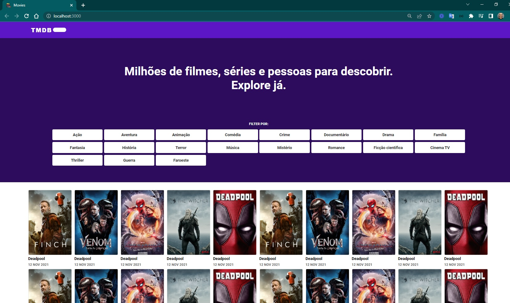

<h4 align="center">
 🚧 Promobit 🚀
</h4>

  

### 💻 Sobre o desafio

Um projeto para consumir informações de uma api de filmes e exibir em um bonito design.

### ✅ Requisitos

- [ ] Usando a API de filmes gratuita [themoviedb](https://developers.themoviedb.org/3/getting-started/introduction) em sua versão 3, você será responsável por criar uma listagem dos filmes mais populares do dia, consultando o endpoint[`GET /movie/popular`](https://developers.themoviedb.org/3/movies/get-popular-movies) para realizar a listagem.
- [ ] Ao clicar em um item dessa listagem, outra página com os detalhes do filme escolhido deve ser exibida. Para acessar mais detalhes sobre o filme, você pode consultar o endpoint [`GET /movie/{movie_id}`](https://developers.themoviedb.org/3/movies/get-movie-details).
- [ ] Para garantir que o usuário encontre o filme que está procurando, essa lista deverá ser paginada.
- [ ] Siga o [layout do figma](https://www.figma.com/file/rM7WPqhLY9ObnGzSCeWLxB/Teste-Front-End) sugerido. Não há necessidade de ser **pixel perfect** mas respeite a composição, fontes e cores.

#### ✅ Requisitos funcionais

- [ ] O usuário deve ter acesso a uma listagem dos filmes mais populares do dia
- [ ] O usuário deve conseguir paginar a lista para encontrar novos filmes
- [ ] O usuário deve ter acesso a uma outra página com detalhes sobre o filme, ao clicar em um item na listagem
- [ ] A página com detalhes de um filme deve possuir uma rota própria e estar preparada para ser indexada em mecanismos de pesquisa

#### ✅ Requisitos não funcionais

- [x] O app deverá ser criado usando [React](https://reactjs.org/)
- [x] Na raiz do projeto, será necessário incluir um arquivo `README.md` com as instruções para construir seu projeto localmente. Opcionalmente você pode detalhar as razões pelas escolhas de ferramentas e técnicas aplicadas ao desafio.
- [x] O app deverá se comportar da mesma forma na última versão estável dos seguintes browsers: Chrome, Firefox, Edge
- [ ] O app deverá ser responsivo

#### ✅ Requisitos Extras

- [ ] Temos insights que nos levam a acreditar que os usuários dessa lista costumam ter uma experiência melhor se conseguirem criar um filtro usando seus gêneros favoritos. Portanto, você também poderá criar filtros de filmes por gênero nessa listagem. 
- [ ] Note que um novo endpoint deverá ser consultado para obter uma lista dos possíveis gêneros a serem filtrados, [`GET /genre/movie/list`](https://developers.themoviedb.org/3/genres/get-movie-list).
- [ ] O usuário deve conseguir filtrar os filmes listados por gênero, com a possibilidade de usar mais de um gênero
- [ ] O usuário deve conseguir remover filtros e a listagem deve ser atualizada de acordo com o filtro removido
- [ ] O usuário deve conseguir voltar para a página de listagem de filmes com os filtros ainda ativos

### 📅 Entregas

Projeto no github com documentação no readme e hospedagem.

#### 📅 Critérios de avaliação

- Boas práticas de desenvolvimento 
  - [ ] html semântico
  - [ ] componentização: pages, components
  - [ ] design patterns
  - [ ] clean code

- Domínio das ferramentas que compõe um app de frontend moderno
  - [x] VSCode
  - [x] Git Bash
  - [x] Github
  - [x] Google Chrome modo Desenvolvedor

- Linguagens que compõe um app de frontend moderno
  - [ ] react para o frontend

- Documentação
  - [ ] explicação para construir o app localmente
  - [ ] histórico
  - [ ] workflow de git: branches main, developer e nome_tarerfa. Abrir pull request da nome_tarefa para a developer, após aprovado pr na developer, mergear da developer na main.
  - [ ] GitHub Wiki
  - [ ] GitHub Issues
  - [ ] GitHub Project Boards
  - [ ] GitHub Readme: Titulo (Badges), Status, Tabela de Conteúdos, Descrição (Emojis), Objetivos (o que o app pode fazer), Layout da aplicação, Deploy da aplicação, Pré-requisitos, Tecnologias, Dependências Instaladas, Libs Instaladas, Como rodar a aplicação, Como rodar os testes, Database, Solução de problemas, Tarefas em aberto, Licença
  - [ ] GitHub Discussions 
  - [ ] GitHub Pages

#### 📅 Tarefas

- [x] iniciar o projeto reactjs: `npx create-react-app`
- [x] organizar e limpar arquivos e códigos
- [x] favicon
- [x] componente navbar: mobile e desktop
- [x] componente top: slogan, filter
- [ ] componente filter: botões em duas linhas, ajustados
- [x] componente films: filme, lista de filmes
- [x] consumir api themoviedb v3: https://api.themoviedb.org/3/movie/popular?api_key=${API_KEY}&language=en-US&page=1 usando fetch then. Cada requisição retorna 20 elementos
- [ ] listar os filmes mais populares do dia com o endpoint `GET /movie/popular`
- [ ] abrir outra página com os detalhes do filme escolhido ao clicar em um item dessa listagem 
- [ ] acessar mais detalhes sobre o filme com o endpoint `GET /movie/{movie_id}`
- [ ] essa lista deverá ser paginada: react-router-dom com `npm install react-router-dom@6`
- [x] fazer o layout do [figma](https://www.figma.com/file/rM7WPqhLY9ObnGzSCeWLxB/Teste-Front-End?node-id=0%3A1&t=3soQNmbQBSGQraj3-0) pixel perfect, respeitando a composição, fontes e cores
- [ ] possuir uma rota própria para a página com detalhes de um filme 
- [ ] a página com detalhes de um filme deve estar preparada para ser indexada em mecanismos de pesquisa
- [ ] responsividade: mobile, tablet, desktop
- [ ] criar um filtro de filmes usando seus gêneros favoritos nessa listagem
- [ ] novo endpoint `GET /genre/movie/list` deverá ser consultado para obter a lista dos possíveis gêneros filtrados
- [ ] filtrar os filmes listados por gênero, com a possibilidade de usar mais de um gênero
- [ ] remover filtros e a listagem deve ser atualizada de acordo com o filtro removido
- [ ] conseguir voltar para a página de listagem de filmes com os filtros ainda ativos 
- [ ] tratar a data e exibir conforme design
- [ ] fazer um componente de carregando para a requisição

#### 📅 Telas

- Desktop

  

  

- Mobile

  

  

### 💡 Referências

- [x] [create-a-new-react-app](https://pt-br.reactjs.org/docs/create-a-new-react-app.html)
- [x] [flaticon](https://www.flaticon.com/free-icon/movie_2798007?term=movie&page=1&position=14&origin=tag&related_id=2798007)
- [x] [de-pixels-px-para-rem](https://dev.to/gabrlcj/tecnica-para-voce-mudar-de-pixels-px-para-rem-2626)
- [x] [letter-spacing](https://developer.mozilla.org/en-US/docs/Web/CSS/letter-spacing)
- [x] [grid-auto-flow](https://developer.mozilla.org/en-US/docs/Web/CSS/grid-auto-flow)
- [x] [grid-template-columns](https://css-tricks.com/almanac/properties/g/grid-template-columns/)
- [x] [auto-sizing-columns-css](https://css-tricks.com/auto-sizing-columns-css-grid-auto-fill-vs-auto-fit/)
- [x] [sass](https://www.npmjs.com/package/sass)
- [x] [classnames](https://www.npmjs.com/package/classnames)
- [x] [paginacao](https://www.freecodecamp.org/portuguese/news/como-criar-uma-paginacao-personalizada-em-react/)
- [x] [projeto 1](https://github.com/matheusmhq/tmdb-react-js)
- [x] [projeto 2](https://github.com/charleseduardome/TheMovieDB)
- [x] [projeto 3](https://www.youtube.com/watch?v=b6N29J_utw4&list=PLOzZAH_pgb_QGWVmQwkRFTYhHuG1qKHIR&index=1)
- [x] [projeto 4](https://www.youtube.com/watch?v=XqxUHVVO7-U)
- [x] [projeto 5](https://www.youtube.com/watch?v=KveKdXSEV7A)
- [x] [projeto 6](https://www.youtube.com/watch?v=I2ibI7MycUw&list=PL_kAgwZgMfWyZ6m8fDwdiwEarr_g6nFxz&index=7)
- [x] [projeto 7](https://www.youtube.com/watch?v=YSlzQlEqTBg)
- [x] [how-to-use-react-router](https://www.freecodecamp.org/news/how-to-use-react-router-version-6)
- [x] [themoviedb](https://developers.themoviedb.org/3/movies/get-movie-lists)

### 🚀 Conclusão

Obrigado e bom desafio!

Feito com ❤️ por Douglas A B Novato. 👋🏽 [Entre em contato!](https://www.linkedin.com/in/douglasabnovato/)

Fonte do projeto na [promobit](https://www.promobit.com.br/) 👋
