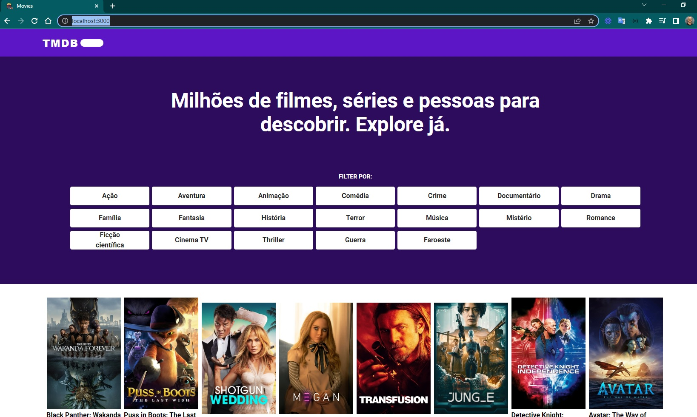
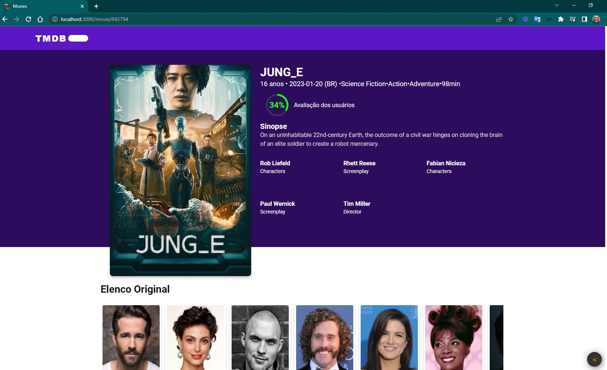
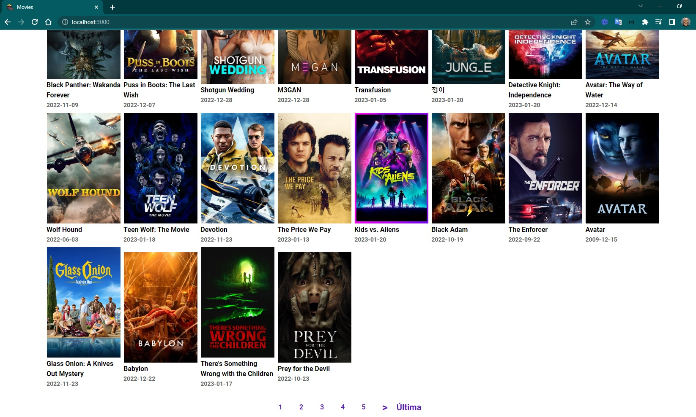
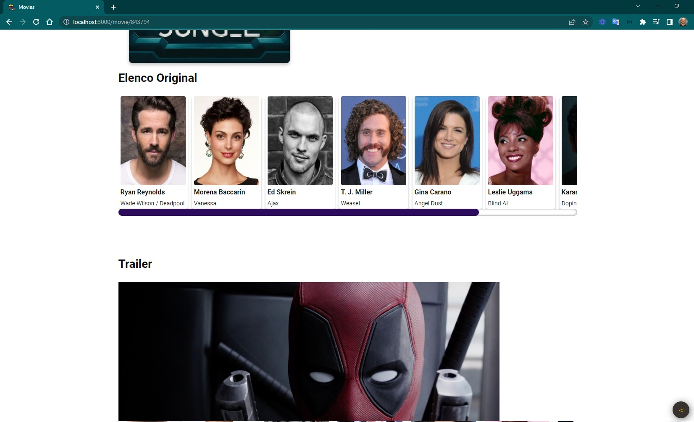
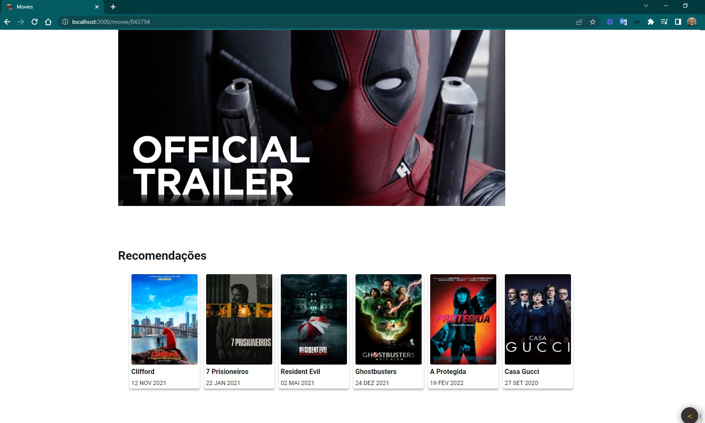

<h1 align="center">
  🎬 Movies App — TMDB Explorer
</h1>

  <b>Aplicação Web para exploração e consulta do catálogo de filmes da API The Movie Database (TMDB).</b>

  
  

---

## 📌 Sumário
- [Sobre o Projeto](#-sobre-o-projeto)
- [Estrutura de Branches & Git Workflow](#-estrutura-de-branches--git-workflow)
- [Especificação de Requisitos & Desafio](#-especificação-de-requisitos--desafio)
  - [Requisitos da Aplicação](#requisitos-da-aplicação)
  - [Requisitos Funcionais](#requisitos-funcionais)
  - [Requisitos Não-Funcionais](#requisitos-não-funcionais)
  - [Requisitos Extras (Filtros & Navegação)](#requisitos-extras-filtros--navegação)
- [Critérios de Avaliação & Boas Práticas](#-critérios-de-avaliação--boas-práticas)
- [Histórico de Tarefas & Entregas Recentes](#-histórico-de-tarefas--entregas-recentes)
- [Métricas de Performance & Produtividade](#-métricas-de-performance--produtividade)
- [Layout da Aplicação](#-layout-da-aplicação)
- [🗺️ Plano Mestre de Evolução (70 Issues)](#️-plano-mestre-de-evolução-70-issues)
- [💡 Referências & Links Úteis](#-referências--links-úteis)
- [👨‍💻 Autor](#-autor)

---

## 💻 Sobre o Projeto

O **Movies App** é uma plataforma frontend moderna desenvolvida em **React**, cujo objetivo principal é consumir a API pública do [The Movie Database (TMDB v3)](https://developers.themoviedb.org/3/getting-started/introduction) para apresentar listagens de filmes populares, detalhar informações técnicas, elenco, trailers oficiais e permitir navegação fluida com busca global via debounce, sincronização de estado na URL e filtros dinâmicos por gêneros.

O projeto foi originalmente concebido como um desafio técnico da **Promobit**, evoluindo para um estudo de caso prático de **Product Management (PM)**, **DevOps** e **Engenharia Frontend**.

---
 
 
## 🌿 Estrutura de Branches & Git Workflow

Para manter o versionamento organizado e seguro, adotamos o seguinte fluxo de trabalho no Git:

- **`main`**: Branch de código estável em produção.
- **`developer-mvp`**: Branch principal de consolidação e integração do ambiente de desenvolvimento.
- **`feature/tarefas`**: Branch ativa de desenvolvimento para refatoração do core, correções e novas funcionalidades.
 

---

## 📋 Especificação de Requisitos & Desafio

### Requisitos da Aplicação
- [x] Usar a API gratuita do [TMDB v3](https://developers.themoviedb.org/3/getting-started/introduction) para criar a listagem dos filmes populares do dia via endpoint `GET /movie/popular`.
- [x] Exibir uma página de detalhes ao clicar em qualquer filme da listagem usando o endpoint `GET /movie/{movie_id}`.
- [x] Seguir a composição visual, cores e fontes definidas no [Layout do Figma](https://www.figma.com/file/rM7WPqhLY9ObnGzSCeWLxB/Teste-Front-End).
- [x] Garantir a navegação entre páginas através de um componente funcional de **paginação**.

### Requisitos Funcionais
- [x] O usuário deve ter acesso à listagem dos filmes mais populares do dia.
- [x] O usuário deve ter acesso à página de detalhes ao selecionar um item da lista.
- [x] O usuário deve conseguir paginar a lista para descobrir novos títulos.
- [x] A página com detalhes de um filme deve possuir rota própria (`/movie/:id`) e estar preparada para indexação (SEO).
- [x] Pesquisa de filmes pelo nome em tempo real com técnica de debounce (delay de 500ms).
- [x] Sincronização automática dos filtros, paginação e termo de busca nos parâmetros de Query String da URL (`useSearchParams`).

### Requisitos Não-Funcionais
- [x] Desenvolvido utilizando a biblioteca **React.js**.
- [x] Arquivo `README.md` completo na raiz do repositório com instruções e decisões de arquitetura.
- [x] Compatibilidade garantida na última versão estável dos navegadores: Chrome, Firefox e Edge.
- [x] Layout totalmente responsivo para desktop, tablet e dispositivos móveis (Mobile First UX).

### Requisitos Extras (Filtros & Navegação)
- [x] Consultar a lista oficial de gêneros através do endpoint `GET /genre/movie/list`.
- [x] Permitir que o usuário filtre os filmes listados selecionando **um ou múltiplos gêneros** simultaneamente (`GET /discover/movie`).
- [x] Permitir a remoção individual de filtros de gênero atualizando a listagem em tempo real.
- [x] Manter os filtros ativos ao retornar da tela de detalhes para a listagem principal através da URL.

---

## 🛠️ Critérios de Avaliação & Boas Práticas

- **Boas Práticas de Desenvolvimento:**
  - [x] HTML5 Semântico (`<main>`, `<header>`, `<nav>`, `<section>`, `<article>`) e acessibilidade (WCAG / ARIA Labels / `.sr-only`).
  - [x] Componentização modular (`pages`, `components`, `services`, `utils`).
  - [x] Clean Code e desacoplamento das chamadas à API via camada dedicada (`src/services/tmdbApi.js`).
- **Domínio de Ferramentas Modernas:**
  - [x] VS Code, Git Bash e GitHub.
  - [x] Google Chrome Developer Tools (Network, Console, Application).
- **Tecnologias & Integrações:**
  - [x] React 18, React Router v6 (compatível com `v7` future flags), CSS3 Responsivo, Fetch API / Async-Await.
- **Governança & Documentação:**
  - [x] GitHub Wiki, Issues, Project Boards e Pull Requests estruturados.
  - [x] Pipeline de Integração Contínua (CI) via **GitHub Actions** (`Node v20`, `actions@v4`).

---

## 📝 Histórico de Tarefas & Entregas Recentes

- [x] Inicialização do projeto com Create React App (`npx create-react-app`).
- [x] Limpeza e estruturação do projeto (favicon, assets, estilos globais).
- [x] Implementação dos componentes de navegação (`Navbar` e `Slogan`).
- [x] Construção da interface da Home (painel de filtros e grid de cards de filmes).
- [x] Consumo inicial da API com Fetch API / Promises e posterior refatoração para `async/await`.
- [x] Criação da rota e página de detalhes (`/movie/:id`).
- [x] Desenvolvimento do componente circular de carregamento de avaliação (Score do Usuário).
- [x] Refatoração declarativa das telas de detalhes para consumo dinâmico do elenco, equipe técnica, trailers no YouTube e recomendações (`Promise.all`).
- [x] Tratamento e formatação de datas em formato brasileiro (`DD/MM/YYYY`) e cálculo de duração em horas e minutos (`Xh Ym`) desacoplados em `src/utils/formatters.js` com testes unitários no Jest (`Issue #05`).
- [x] Desenvolvimento do componente modular de **Paginação** reutilizável (`<Pagination />`).
- [x] Centralização de requisições HTTP na camada de serviços `src/services/tmdbApi.js` (`Issue #14`).
- [x] Configuração e correção do pipeline de CI automatizada com **GitHub Actions** (`.github/workflows/ci.yml`).
- [x] Implementação de componentes de **Loading Skeleton** animado (`<MovieCardSkeleton/>` e `<DetailsSkeleton/>`) e tratamento para filmes sem poster (`Issues #15, #16, #17`).
- [x] Reformulação da **Responsividade Mobile** na Home e Details com escala base e carrossel de rolagem horizontal para elenco (`Issues #31, #32`).
- [x] Resolução de warnings de deprecação do React Router v6 habilitando `future` flags para a v7.
- [x] Implementação de **Busca Global de Filmes** por nome com técnica de **Debounce** (`Issue #26`).
- [x] Sincronização do estado de busca, gêneros e página com a **URL** (`Query String`) usando `useSearchParams` (`Issue #52`).
- [x] Refatoração para **HTML5 Semântico** (`main`, `header`, `nav`, `section`, `article`) e inclusão de rótulos de acessibilidade ARIA (`Issue #35`).

---

## ⏱️ Métricas de Performance & Produtividade

Acompanhamento dos ciclos de desenvolvimento dedicados à construção do MVP:
- **08/02:** 07:00 – 11:44
- **07/02:** 07:00 – 12:40 | 13:40 – 18:05
- **06/02:** 07:30 – 12:35 | 13:20 – 19:40
- **03/02:** 10:50 – 17:30

---

## 🎨 Layout da Aplicação

### Visualização Desktop

  
  
  
  
  

### Visualização Mobile

  

---

## 🗺️ Plano Mestre de Evolução (70 Issues)

Para guiar a reativação, escalabilidade e qualidade do ecossistema do **Movies**, o roadmap foi fatiado em **70 Issues estruturadas** divididas em 7 Fases estratégicas:

### 🚀 Fase 1: Governança, CI/CD e Qualidade (Issues 01–10)
- [x] **Issue #01 — `[DevOps] Setup do GitHub Actions para Pipeline de CI`**: Configuração do workflow automatizado de validação de PRs.
- [ ] **Issue #02 — `[DevOps] Integração de Linter e Formatador (ESLint & Prettier)`**: Padronização de estilo de código com Husky e `lint-staged`.
- [ ] **Issue #03 — `[QA] Configuração do Ambiente de Testes (Jest + React Testing Library)`**: Mocks globais e scripts de testes unitários.
- [x] **Issue #04 — `[DevOps] Variáveis de Ambiente e Segurança (.env)`**: Isolamento de chaves secretas e credenciais de API.
- [x] **Issue #05 — `[QA] Teste Unitário dos Utilitários de Data e Duração`**: Garantia de cobertura para `formatDate` e `formatRuntime`.
- [ ] **Issue #06 — `[DevOps] Deploy Automatizado com Vercel/GitHub Pages`**: Pipeline de entrega contínua (CD) disparada na `main`.
- [ ] **Issue #07 — `[QA] Teste do Componente de Avaliação`**: Validação declarativa do gráfico circular de pontuação.
- [ ] **Issue #08 — `[Governance] Padronização de Issue Templates (User Stories)`**: Modelos para cadastro de bugs e novas funcionalidades.
- [ ] **Issue #09 — `[Governance] Criação do CONTRIBUTING.md e Guia do Git`**: Documentação de fluxo de branches e regras de contribuição.
- [ ] **Issue #10 — `[QA] Setup de Testes End-to-End com Cypress/Playwright`**: Automação de testes E2E dos fluxos principais.

### ⚙️ Fase 2: Refatoração do Core & Assincronismo (Issues 11–20)
- [x] **Issue #11 — `[Tech] Migração de Fetch/Then para Async/Await`**: Refatoração global de chamadas HTTP para padrão moderno.
- [x] **Issue #12 — `[Tech] Tratamento de Erros com Try/Catch e Fallbacks`**: Telas de erro amigáveis para falhas de rede na API.
- [x] **Issue #13 — `[Tech] Remoção de Manipulação Direta do DOM em Details`**: Substituição do `querySelector` por estado nativo React.
- [x] **Issue #14 — `[Tech] Camada de Serviço Centralizada (Service Layer)`**: Módulo desacoplado de chamadas à TMDB API.
- [x] **Issue #15 — `[Tech] Loading Skeletons na Home`**: Esqueletos animados de carregamento para os cards da grid.
- [x] **Issue #16 — `[Tech] Loading Skeletons em Details`**: Feedback visual enquanto carrega banner e elenco.
- [x] **Issue #17 — `[Tech] Tratamento para Filmes Sem Poster`**: Imagem placeholder quando o item não tiver imagem na API.
- [x] **Issue #18 — `[Tech] Normalização do Objeto Movie`**: Padronização da estrutura de dados antes do consumo da UI.
- [x] **Issue #19 — `[Tech] Scroll Automático ao Alternar Rotas`**: Garantia de rolagem para o topo ao trocar de tela.
- [ ] **Issue #20 — `[Tech] Hook Customizado useFetch`**: Abstração para chamadas HTTP reutilizáveis.

### 🎨 Fase 3: Refinamento de UX/UI, Filtros e Paginação (Issues 21–30)
- [x] **Issue #21 — `[Feature] Consumo Dinâmico de Gêneros (GET /genre/movie/list)`**: Integração oficial dos gêneros da TMDB.
- [x] **Issue #22 — `[Feature] Filtro Múltiplo de Gêneros na Home`**: Filtro combinado ativando o endpoint `/discover/movie`.
- [x] **Issue #23 — `[Feature] Desseleção e Limpeza de Filtros`**: Remoção de gêneros ativos em tempo real.
- [x] **Issue #24 — `[Feature] Componente de Paginação Dinâmica`**: Substituição de números estáticos por controles inteligentes.
- [x] **Issue #25 — `[Feature] Limite de Páginas e Navegação Seguro`**: Proteção contra extrapolação do limite da API (500 páginas).
- [x] **Issue #26 — `[Feature] Busca Global com Debounce`**: Barra de pesquisa inteligente com delay programado.
- [x] **Issue #27 — `[UX] Destaque Visual para Gêneros Selecionados`**: Feedback visual destacado nos botões ativos.
- [x] **Issue #28 — `[UX] Mensagem de Nenhum Resultado Encontrado`**: Estado vazio para buscas sem retorno.
- [x] **Issue #29 — `[UX] Correção de Tipografia e Unidades do CSS (rem)`**: Ajuste do reset e escala de fontes globais.
- [ ] **Issue #30 — `[UX] Transições Suaves entre Páginas`**: Animações suaves de transição na interface.

### 📱 Fase 4: Responsividade e Acessibilidade (Issues 31–40)
- [x] **Issue #31 — `[UI] Adaptação Responsive-First da Home`**: Grid fluida para telas de celulares e tablets.
- [x] **Issue #32 — `[UI] Adaptação Responsive da Tela de Details`**: Reorganização vertical dos elementos em mobile.
- [x] **Issue #33 — `[UI] Carrossel Horizontal para Elenco`**: Scroll de elenco otimizado para navegação por toque.
- [x] **Issue #34 — `[UI] Player de Trailer Responsivo (16:9)`**: Container adaptável para o iframe do YouTube.
- [x] **Issue #35 — `[A11y] Atributos Alt Descritivos em Imagens`**: Acessibilidade para leitores de tela em posters e fotos.
- [x] **Issue #36 — `[A11y] Navegação por Teclado nos Filtros e Botoes`**: Foco e acessibilidade por tecla Tab.
- [x] **Issue #37 — `[A11y] Contraste de Cores WCAG`**: Validação e ajuste de contraste nos textos e botões.
- [x] **Issue #38 — `[UI] Botão Flutuante de Retorno`**: Ajuste no posicionamento do botão de voltar à lista.
- [x] **Issue #39 — `[UI] Componentes Navbar e Slogan Responsivos`**: Alinhamento do cabeçalho institucional.
- [x] **Issue #40 — `[UI] Testes Cross-Browser`**: Garantia de compatibilidade em navegadores diversos.

### 🍿 Fase 5: Integração Dinâmica e Mídia em Details (Issues 41–50)
- [x] **Issue #41 — `[Feature] Elenco Dinâmico (GET /movie/{id}/credits)`**: Substituição de atores estáticos pelos dados reais.
- [x] **Issue #42 — `[Feature] Equipe Técnica e Direção Dinâmica`**: Exibição dos diretores e roteiristas na ficha técnica.
- [x] **Issue #43 — `[Feature] Trailer Oficial Dinâmico (GET /movie/{id}/videos)`**: Player com vídeo oficial do filme.
- [x] **Issue #44 — `[Feature] Recomendações Dinâmicas`**: Exibição de filmes similares com links de navegação.
- [x] **Issue #45 — `[Feature] Navegação Encadeada entre Recomendações`**: Troca contínua de detalhes entre filmes recomendados.
- [ ] **Issue #46 — `[Feature] Formatação de Orçamento e Receita`**: Exibição financeira formatada em dólares.
- [ ] **Issue #47 — `[Feature] Produtoras e Países de Origem`**: Informações institucionais do filme.
- [ ] **Issue #48 — `[Feature] Slogan do Filme (Tagline)`**: Exibição da frase de impacto oficial do filme.
- [ ] **Issue #49 — `[Feature] Modal de Zoom para o Poster`**: Visualização ampliada do poster em alta definição.
- [ ] **Issue #50 — `[Feature] Classificação Indicativa`**: Certificação de faixa etária recomendada por país.

### 🧠 Fase 6: Estado Avançado, SEO e Cache (Issues 51–60)
- [ ] **Issue #51 — `[Tech] Integração com TanStack Query (React Query)`**: Cache automatizado de requisições.
- [x] **Issue #52 — `[Tech] Persistência de Filtros na URL`**: Sincronização do estado de busca e página na Query String.
- [ ] **Issue #53 — `[SEO] Metadados Dinâmicos com React Helmet`**: Títulos e Open Graph para redes sociais por filme.
- [ ] **Issue #54 — `[Tech] Favoritar Filmes em LocalStorage`**: Gerenciamento de filmes favoritados pelo usuário.
- [ ] **Issue #55 — `[Feature] Tela Dedicada aos Meus Favoritos`**: Rota `/favorites` para exibição de itens salvos.
- [ ] **Issue #56 — `[Tech] Suporte Offline/PWA com Service Workers`**: Acesso básico e cache em situações offline.
- [ ] **Issue #57 — `[Tech] Otimização de Imagens (SrcSet)`**: Download adaptável de posters de acordo com a tela.
- [ ] **Issue #58 — `[Tech] Monitoramento com Web Vitals`**: Otimização de métricas de performance (LCP, FID, CLS).
- [ ] **Issue #59 — `[SEO] Geração de Sitemap e Robots.txt`**: Estratégias de indexação em buscadores.
- [ ] **Issue #60 — `[Tech] Controle de Rate Limit e Cache Local`**: Mitigação de requisições excessivas à API.

### 🏆 Fase 7: Recursos Especiais, Analytics e Encerramento (Issues 61–70)
- [ ] **Issue #61 — `[UX/Content] Feature Especial: Timeline 007`**: Trilha temática da franquia James Bond.
- [ ] **Issue #62 — `[Analytics] Métricas de Uso e Comportamento`**: Monitoramento de cliques e buscas mais populares.
- [ ] **Issue #63 — `[Feature] Sistema de Avaliação do Usuário`**: Possibilidade do usuário atribuir sua própria nota ao filme.
- [ ] **Issue #64 — `[Feature] Compartilhamento em Redes Sociais`**: Botões rápidos para envio via WhatsApp e Twitter.
- [ ] **Issue #65 — `[Feature] Toggle de Dark/Light Mode`**: Suporte a temas claro e escuro.
- [ ] **Issue #66 — `[Feature] Filtro por Ano de Lançamento`**: Seleção de filmes por décadas e anos.
- [x] **Issue #67 — `[Documentation] Atualização Geral do README Profissional`**: Documentação executiva do repositório.
- [ ] **Issue #68 — `[Governance] Consolidação da GitHub Wiki`**: Documentação técnica e arquitetural completa.
- [ ] **Issue #69 — `[QA] Auditoria do Lighthouse (Nota ≥90)`**: Validação final de performance, acessibilidade e SEO.
- [ ] **Issue #70 — `[Product] Release Oficial v2.0.0 & Retrospectiva`**: Encerramento do ciclo e publicação da versão final.

---

## 💡 Referências & Links Úteis

- [Documentation — Create React App](https://pt-br.reactjs.org/docs/create-a-new-react-app.html)
- [API Documentation — The Movie Database (TMDB v3)](https://developers.themoviedb.org/3/getting-started/introduction)
- [Figma Layout oficial do desafio](https://www.figma.com/file/rM7WPqhLY9ObnGzSCeWLxB/Teste-Front-End)
- [Artigo — Guia de Paginação Customizada em React](https://www.freecodecamp.org/portuguese/news/como-criar-uma-paginacao-personalizada-em-react/)
- [CSS Tricks — A Complete Guide to Grid](https://css-tricks.com/snippets/css/complete-guide-grid/)

---

## 👨‍💻 Autor

Feito com ❤️ por **Douglas A B Novato**.  
👋🏽 Entre em contato e acompanhe outros projetos:

- **LinkedIn:** [linkedin.com/in/douglasabnovato](https://www.linkedin.com/in/douglasabnovato/)
- **GitHub:** [@douglasabnovato](https://github.com/douglasabnovato)
- **Website:** [douglasabnovato.dev](https://douglasabnovato.dev)

---
*Fonte e inspiração do desafio original fornecidos pela equipe de engenharia da **Promobit**.* 👋