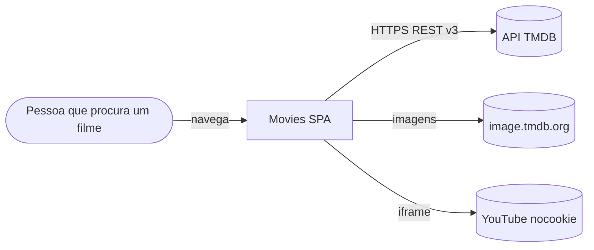
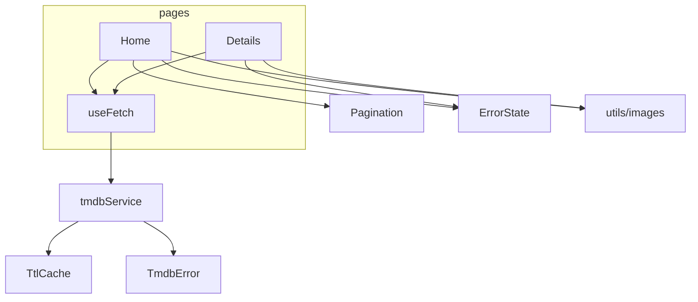

# Arquitetura alvo — Movies (TMDB Explorer)

## 1. Visão C4

### Nível 1 — Contexto



### Nível 2 — Contêineres

| Contêiner | Tecnologia | Responsabilidade |
|---|---|---|
| SPA | React 18 + React Router 6 (HashRouter), CRA 5 | Interface, estado de filtros na URL, cache em memória |
| Hospedagem | GitHub Pages (gratuito) | Servir o build estático |
| CI | GitHub Actions | Testes, build com a chave vinda de *secret* e deploy |

### Nível 3 — Componentes da SPA



## 2. Estrutura de pastas

```
src/
├── components/
│   ├── ErrorState/        (novo) mensagem + botão "Tentar novamente"
│   ├── Footer/
│   ├── Pagination/        (a11y: aria-current, rótulos)
│   └── Skeleton/
├── hooks/
│   └── useFetch.js        (reescrito) carrega, cancela e refaz a requisição
├── pages/
│   ├── Home/
│   └── Details/
├── services/
│   ├── cache.js           (novo) cache TTL com limite de entradas
│   └── tmdbApi.js         (reescrito) sem chave no código, erros tipados
└── utils/
    ├── formatters.js
    └── images.js          (novo) URL do pôster ou placeholder local
public/
└── placeholder.svg        (novo) substitui via.placeholder.com
```

## 3. Modelo de dados

O projeto não tem banco. O "modelo" é o estado da interface, com uma regra de **fonte única de verdade**:

| Estado | Fonte | Observação |
|---|---|---|
| `search`, `genres`, `page` | Query string da URL | Permite compartilhar e voltar do detalhe sem perder o filtro |
| Listagem e detalhe | Cache TTL em memória (derivado da API) | Chave = endpoint + parâmetros, **sem** a chave da API |
| Carregando / erro | Hook `useFetch` | Estado efêmero da tela |

Entidade `Movie` consumida (subconjunto normalizado da TMDB):

| Campo | Tipo | Uso |
|---|---|---|
| `id` | number | Rota `/movie/:id` |
| `title` / `original_title` | string | Título exibido |
| `poster_path` | string \| null | Pôster ou placeholder |
| `release_date` | `AAAA-MM-DD` | Formatado sem conversão de fuso |
| `vote_average` | number 0–10 | Percentual no gráfico circular |
| `runtime`, `genres`, `overview` | — | Somente no detalhe |

## 4. Contratos consumidos (TMDB v3)

| Uso | Método e rota | Parâmetros |
|---|---|---|
| Gêneros | `GET /genre/movie/list` | `language=pt-BR` |
| Populares | `GET /movie/popular` | `page` |
| Por gênero | `GET /discover/movie` | `with_genres=28,12`, `page` |
| Busca | `GET /search/movie` | `query`, `page` |
| Detalhe completo | `GET /movie/{id}` | `append_to_response=credits,videos,recommendations` |

Erros normalizados pela classe `TmdbError`:

| `kind` | Quando | Mensagem na tela |
|---|---|---|
| `config` | `REACT_APP_TMDB_KEY` ausente | Explica como configurar a chave |
| `not_found` | HTTP 404 | "Filme não encontrado" + link para a lista |
| `http` | Outros 4xx/5xx | "Não foi possível carregar" + tentar novamente |
| `network` | `fetch` rejeitado (offline, DNS, CORS) | Idem, sugerindo verificar a conexão |
| `aborted` | Requisição cancelada | Ignorado (não é erro para a pessoa) |

## 5. Decisões de arquitetura (ADR)

### ADR-001 — Remover a chave do código e aceitar a exposição no bundle

- **Contexto:** a chave estava como valor padrão no código e o `src/.env` foi versionado.
- **Decisão:** a chave vem só de `REACT_APP_TMDB_KEY` (arquivo `.env` local não versionado ou *secret* do CI). Sem chave, a aplicação mostra um erro de configuração.
- **Consequência:** em uma SPA estática, a chave da TMDB v3 continua visível no JavaScript publicado. É um risco aceito porque a chave é gratuita, somente leitura e com limite de uso; a alternativa (proxy em função *serverless*) fica fora do escopo do MVP. A chave antiga precisa ser **revogada** na TMDB, pois ficou no histórico do Git.

### ADR-002 — Cancelamento com `AbortController` em vez de flag "ignorar"

- **Contexto:** respostas fora de ordem sobrescreviam a busca mais recente (D3).
- **Decisão:** cada efeito cria um `AbortController`; o *cleanup* do `useEffect` aborta a requisição anterior.
- **Consequência:** além de corrigir a corrida, economiza banda: a requisição obsoleta é interrompida no navegador.

### ADR-003 — Cache TTL próprio em vez de TanStack Query

- **Contexto:** voltar a uma página já vista refazia a requisição (Issue #60 do roadmap).
- **Decisão:** cache em memória com TTL de 5 min e limite de 100 entradas, com remoção da entrada mais antiga (o `Map` preserva a ordem de inserção, então inserir e remover custam O(1)).
- **Consequência:** zero dependências novas. A Issue #51 (TanStack Query) continua no roadmap para quando houver mutações ou *refetch* em segundo plano.

### ADR-004 — `append_to_response` no detalhe

- **Decisão:** trocar 4 requisições paralelas por 1 (`/movie/{id}?append_to_response=credits,videos,recommendations`).
- **Consequência:** menos latência em rede móvel e menos consumo da cota; uma única resposta define se o filme existe (404) ou não.

### ADR-005 — Placeholder local

- **Decisão:** `public/placeholder.svg` substitui `via.placeholder.com`, que foi desativado.
- **Consequência:** nenhuma dependência externa para o estado "sem pôster".

## 6. Fora do escopo deste ciclo

- Favoritos, PWA/offline, React Helmet/Open Graph, TanStack Query e testes E2E (Issues #10, #51, #53–#56).
- Migração do Create React App para Vite (o CRA está sem manutenção; recomendado em um ciclo próprio).
- Alterações no workflow `.github/workflows/ci.yml` (ele já roda testes e build).
